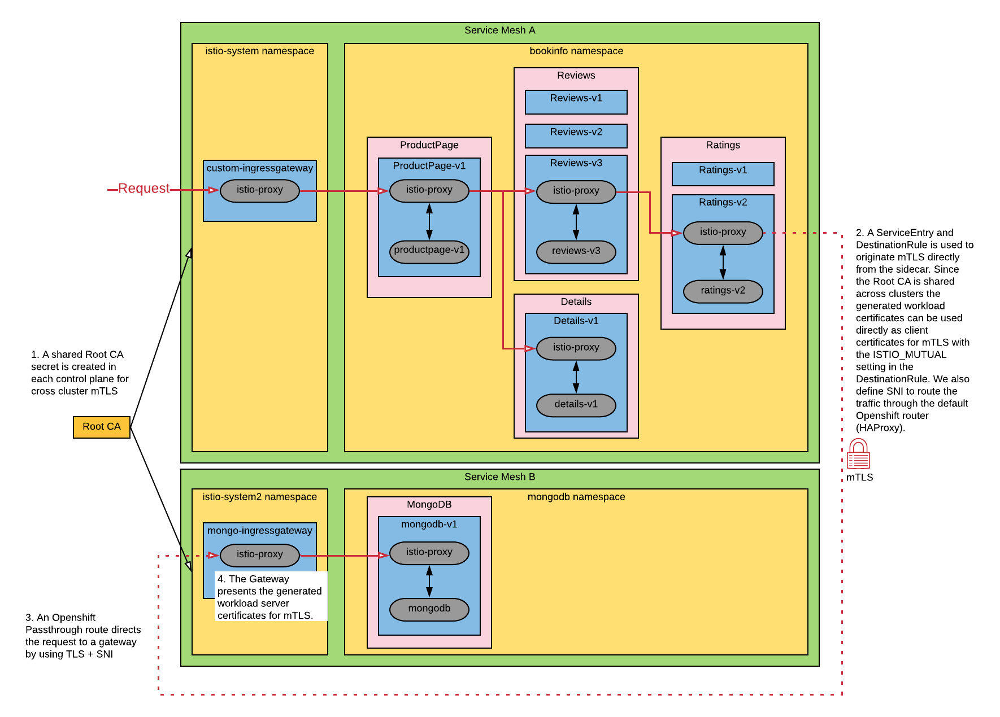

# Federated trust across Service Mesh domains

## Motivation

Mutual TLS (mTLS) ensures traffic is trusted and secure between both client and server and is a primary motivation for using a Service Mesh. If your organization has a requirement to implement Multicluster Service Meshes, you can still utilize mTLS for cross-cluster communication if both Service Mesh Control Planes (SMCPs) are configured to use the same root CA when signing workload certificates. Additionally, mTLS can be performed directly from a sidecar to another control plane's ingress gateway. The result is federated trust between SMCPs.

This example differs from Istio's [Replicated control planes Multicluster Installation](https://istio.io/latest/docs/setup/install/multicluster/gateways/) example in that we aren't configuring DNS since, as of this writing, the istiocoredns feature is not currently supported (though it is on [the roadmap](https://medium.com/@mageru/openshift-4-6-announcement-highlights-9e5601d97c0d)). For this reason, we need to manually create ServiceEntries because services are not auto-discovered between SMCPs without this feature.

To demonstrate, we will deploy the bookinfo application into a control plane and configure the ratings-v2 application to communicate to a mongo instance in a different control plane via an ingress gateway. A ServiceEntry and DestinationRule is used to instruct the sidecar to originate mTLS using the generated workload certificates from Citadel. The Gateway defined for the mongo ingress gateway within the other control plane is also configured to present its own generated workload certificates for mTLS.

A single OCP cluster is used to demonstrate this configuration, but since communication is performed via the exposed Openshift Route between control planes one could deploy the mongodb control plane and application in a different Openshift cluster with the same result.



## Setup

```sh
#Service Mesh A
oc new-project istio-system
oc new-project bookinfo

#Service Mesh B
oc new-project istio-system2
oc new-project mongodb

#Cert Manager
oc new-project cert-manager
```

## Deploy cert-manager (skip if already present in the cluster)

```shell
oc apply --validate=false -f https://github.com/jetstack/cert-manager/releases/download/v0.15.0/cert-manager.yaml
```

## Deploy local root CA to both control planes

```shell
#Service Mesh A
helm upgrade -i cert-manager -n istio-system helm/cert-manager

helm upgrade -i rootca helm/install-cacerts -n istio-system \
  --set rootca.tls_crt=$(oc get secret rootca -n istio-system -o jsonpath='{.data.tls\.crt}') \
  --set rootca.tls_key=$(oc get secret rootca -n istio-system -o jsonpath='{.data.tls\.key}')

#Service Mesh B
helm upgrade -i rootca helm/install-cacerts -n istio-system2 \
  --set rootca.tls_crt=$(oc get secret rootca -n istio-system -o jsonpath='{.data.tls\.crt}') \
  --set rootca.tls_key=$(oc get secret rootca -n istio-system -o jsonpath='{.data.tls\.key}')
```

## Install control planes using common root cacerts

> Note: with the below configuration defined in the SMCP, Citadel will use the **cacerts** secret (created in both control planes from previous commands) as the root certificate instead of its own self-signed certificate.
>
> ```yaml
> apiVersion: maistra.io/v1
> kind: ServiceMeshControlPlane
> metadata:
>   name: basic-install
> spec:
>   istio:
>     security:
>       selfSigned: false
> ...
> ```

```sh
#Service Mesh A
helm upgrade -i istio-system-control-plane -n istio-system helm/istio-system-control-plane
#Service Mesh B
helm upgrade -i istio-system2-control-plane -n istio-system2 helm/istio-system2-control-plane
```

## Install mongodb in istio-system2

```sh
#Service Mesh B
helm upgrade -i mongodb helm/mongodb -n mongodb --set mongodb.host=$(oc get route mongo -n istio-system2 -o jsonpath={.spec.host})
```

## Create user and add ratings data to mongodb

```sh
#Service Mesh B
oc exec deploy/mongodb-v1 -c mongodb -n mongodb -i -t -- /bin/bash -c "cat <<EOF | mongo -u admin -p redhat --authenticationDatabase admin
use test
db.createUser(
   {
     user: \"bookinfo\",
     pwd: \"redhat\",
     roles: [ \"read\"]
   }
);
db.createCollection(\"ratings\");
db.ratings.insert(
  [{rating: 1},
   {rating: 1}]
);
db.ratings.find({});
EOF"
```

## Install bookinfo in istio-system

> Note: [Service entries for TCP traffic](https://istio.io/latest/blog/2018/egress-tcp/#service-entries-for-tcp-traffic) should have CIDR addresses defined. The bookinfo ratings v2 application will use the mongodb ServiceEntry.

```sh
#Service Mesh A
IP_ADDRESSES=$(echo "{$(echo $(host $(oc get route api -n istio-system -o jsonpath={'.spec.host'}) | cut -d" " -f4) | sed -e "s/ /,/g")}")
# or set manually, for example IP_ADDRESSES={3.131.22.164,3.129.227.164}

helm upgrade -i bookinfo helm/bookinfo -n bookinfo \
  --set mongodb.host=$(oc get route mongo -n istio-system2 -o jsonpath={.spec.host}) \
  --set control_plane.ingressgateway.host=$(oc get route api -n istio-system -o jsonpath={'.spec.host'}) \
  --set mongodb.addresses=$IP_ADDRESSES
```

## Verify mTLS works between SMCP domains

Open the following url in a web browser. If you get the single ratings star it works.

```sh
#Service Mesh A
echo "https://$(oc get route api -n istio-system -o jsonpath={'.spec.host'})/productpage"
```


## How to regenerate Istio workload certificates in a namespace

```sh
SECRETS=$(oc get secrets -n istio-system -o name | egrep 'istio\.')
for s in $SECRETS; do oc delete $s -n istio-system; done
```
